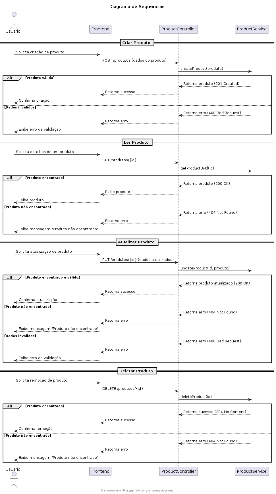

# Diagrams

Repositório para estudo de ferramentas de Diagramas como Código.

## PlantUml

- https://www.plantuml.com/

<details>
<summary>Diagrama de Sequencia/summary>
<pre>



</pre>
</details>

### Dependencias Ubuntu/Codespace
  
```sh
sudo apt update
pip3 install pydot graphviz
```

### Visual Code

- Instalar extensão **PlantUML**


## MermaidJS

- https://mermaid.js.org/intro/
  
## Diagrams (Python)

- https://diagrams.mingrammer.com/

### Pre req

```
sudo apt install graphviz
```

```
<details>
<summary>View Source</summary>
<pre>
@startuml
skinparam monochrome true
Alpha -> Bravo: Step 1
Bravo -> Charlie: Step 2
== My Divider ==
Charlie -> Bravo: Step 3
Bravo -> Alpha: Step 4
@enduml
</pre>
</details>
```
